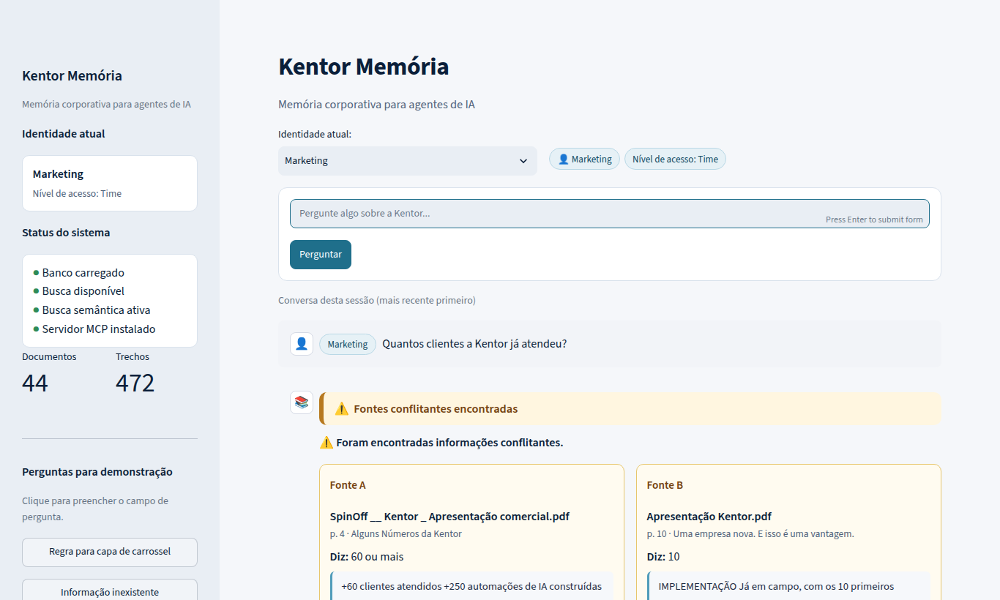
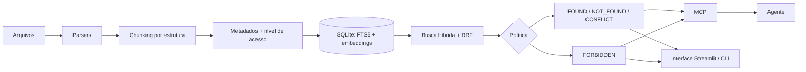

# Kentor · Memória corporativa para agentes de IA (MCP)

Organiza o acervo da Kentor (Markdown, PDF, Word, PowerPoint, TXT, CSS, SVG) e serve esse conhecimento a agentes de IA (Claude Code, Codex) por um **servidor MCP**. Cada pessoa recebe só o que pode ver, e o controle é aplicado no backend. Toda resposta tem um status explícito:

| Status | Quando |
|---|---|
| `FOUND` | Há evidência suficiente → resposta + fontes (arquivo, seção/página/slide, trecho, score) |
| `NOT_FOUND` | O acervo não sustenta a resposta → "Não encontrei essa informação no material disponível." |
| `FORBIDDEN` | Existe informação, mas fora do nível da identidade → nenhum conteúdo é devolvido |
| `CONFLICT` | Fontes divergem sem declaração de substituição → mostra todas, não escolhe |

Há três formas de usar, todas sobre o **mesmo** serviço de respostas (`KnowledgeService.ask`): a **interface gráfica** (`kentor ui`), a **linha de comando** (`kentor ask`) e o **servidor MCP**, usado por agentes.



Documentação: [DECISOES.md](DECISOES.md) · [Arquitetura](docs/architecture.md) · [Análise do acervo](docs/ANALISE_ACERVO.md) · [Avaliação](docs/EVAL.md) · [Demo](docs/DEMO.md) · [Apresentação](docs/APRESENTACAO.md) · [Como explicar](docs/COMO_EXPLICAR.md) · [Transcrições reais no Claude Code](docs/transcripts/claude-code.md)

---

## Jeito mais fácil (Windows, sem terminal)

1. Instale o Python (python.org). Na primeira tela do instalador, marque **"Add python.exe to PATH"**.
2. Descompacte este projeto e a amostra do acervo (`amostra-acervo 2.zip`), por exemplo em **Downloads**.
3. Dê **dois cliques** em **`Abrir Kentor Memoria.bat`**.

Na primeira vez, ele instala tudo, encontra o acervo sozinho em Downloads/Desktop/Documentos (ou pede para você arrastar a pasta para a janela) e indexa. Depois abre o navegador em http://localhost:8501. Nas próximas vezes, os dois cliques abrem direto. Para encerrar, feche a janela preta.

## Pré-requisitos

- Python **3.11+**
- ~500 MB livres (dependências + modelo de embeddings, baixado uma vez)
- Acesso à internet **só na primeira ingestão**, para baixar o modelo multilíngue do HuggingFace. Sem internet, o sistema usa automaticamente o fallback offline (LSA).
- Opcional: chave do OpenRouter (a resposta é redigida e verificada por LLM). Sem chave, tudo funciona com respostas extrativas.

## Instalação

```bash
git clone <este-repo> kentor-memoria && cd kentor-memoria

python -m venv .venv
source .venv/bin/activate          # Windows: .venv\Scripts\activate

pip install -e ".[dev]"
cp .env.example .env               # Windows: copy .env.example .env
```

### `.env`

| Variável | Padrão | Para quê |
|---|---|---|
| `KENTOR_ACERVO_DIR` | `data/acervo` | Pasta do acervo |
| `KENTOR_DB_PATH` | `data/kentor.db` | Banco SQLite |
| `KENTOR_EMBEDDINGS` | `auto` | `auto` (fastembed → LSA), `fastembed` ou `lsa` |
| `OPENROUTER_API_KEY` | vazio | Opcional. **Nunca comite.** |
| `KENTOR_LLM_MODE` | `auto` | `off` força respostas extrativas |
| `OPENROUTER_MODEL` | `google/gemini-2.5-flash-lite` | Modelo do OpenRouter |
| `KENTOR_IDENTITY` | — | Identidade do servidor MCP (normalmente definida na config do cliente) |

## Colocar o acervo e ingerir

O acervo **não é versionado** (é material da empresa). Descompacte a amostra e aponte para ela:

```bash
# opção 1: copiar/linkar para data/acervo
unzip "amostra-acervo 2.zip" -d /tmp/acervo
ln -s "/tmp/acervo/amostra-acervo 2" data/acervo        # Windows: mklink /D data\acervo "C:\...\amostra-acervo 2"

# opção 2: usar outro caminho
kentor ingest --source "/caminho/para/amostra-acervo 2"
```

```bash
kentor ingest        # 1ª vez: ~4 s + download do modelo (uma vez)
kentor ingest        # 2ª vez: nada muda → "unchanged": 44, sem duplicar
kentor stats         # documentos, chunks, modelo de embeddings, custo de LLM acumulado
```

## Interface gráfica (recomendada para demonstração)

```bash
kentor ui                        # abre o navegador em http://localhost:8501
# alternativas (Windows/macOS/Linux):
python scripts/run_ui.py
streamlit run app.py
```

Para encerrar, aperte **Ctrl+C** no terminal.

Como usar:

1. Escolha a **identidade** no seletor "Identidade atual" (Marketing, Software, Vendas ou Sócio). A lista vem de `config/identities.yaml`.
2. Digite a pergunta no campo **"Pergunte algo sobre a Kentor..."** e aperte **Enter** ou clique em **Perguntar**.
3. A resposta mostra o status (✅ encontrada · 🔎 não encontrada · 🔒 sem permissão · ⚠️ conflito) e, em **Fontes consultadas**, o arquivo, o caminho, a seção, a página/slide e o trecho usado.
4. Na barra lateral ficam o status do sistema (banco, busca, MCP), o nº de documentos e trechos indexados e as **Perguntas para demonstração**. Clicar numa delas só preenche o campo.

Se o índice ainda não existir, a barra lateral mostra o botão **"Indexar acervo agora"**.

> A interface é só apresentação: ela chama `KnowledgeService.ask(pergunta, identidade)`, a mesma função do CLI e do MCP, e exibe o que volta. Em FORBIDDEN, o backend já devolve a resposta **sem** o conteúdo restrito; não existe nada escondido na tela. O seletor de identidade existe para a demonstração. Numa implantação real, a identidade viria do login, assim como no MCP ela vem da configuração do processo.

## Perguntar pela linha de comando

```bash
kentor ask "Qual é a regra da casa para capa de carrossel?" -i marketing
kentor ask "Quanto a empresa cobra por um projeto de automação?" -i marketing   # FORBIDDEN
kentor ask "Quanto a empresa cobra por um projeto de automação?" -i socio       # FOUND + valores
kentor ask "Qual ferramenta a Kentor usa para emitir nota fiscal?" -i socio     # NOT_FOUND
kentor ask "Quantos clientes a Kentor já atendeu?" -i marketing                 # CONFLICT
kentor logs          # observabilidade: identidade, status, tempos, modelo, custo
python scripts/demo.py   # roteiro completo da demo no terminal
```

## Testes

```bash
pytest                       # 111 testes (1 pulado sem OPENROUTER_API_KEY)
python scripts/evaluate.py   # 40 perguntas reais → 38 OK + 2 limitações conhecidas
python scripts/benchmark.py  # tempos de ingestão e consulta (use --scale 10 para escala)
```

Os testes que usam o acervo real procuram `data/acervo` (ou `KENTOR_ACERVO_DIR`) e são **pulados com aviso** se ele não existir. Por padrão, os testes usam o LSA (determinístico). Para testar com o modelo multilíngue: `KENTOR_TEST_EMBEDDINGS=fastembed pytest`.

Cobertura: a interface gráfica, testada com o `AppTest` do Streamlit (`tests/test_ui_bridge.py`): FOUND, NOT_FOUND, FORBIDDEN, CONFLICT, troca de identidade, botões de demo e primeiro uso sem índice. Também as 6 situações do case (`tests/test_case_scenarios.py`); o protocolo MCP real via stdio (`tests/test_mcp_protocol.py`); permissões, hashing, parsers (7 formatos), chunking, retrieval, citações, vazamento, versionamento/supersessão e LLM (com OpenRouter simulado).

## Iniciar o servidor MCP

```bash
KENTOR_IDENTITY=marketing python -m kentor_memoria.mcp_server     # stdio
# ou: KENTOR_IDENTITY=marketing kentor serve
```

Ferramentas: `ask_knowledge(question)`, `search_knowledge(query, top_k)`, `get_source(document_id, chunk_id)`, `health()`, `whoami()`.

### Claude Code

O repositório já traz `.mcp.json` com três servidores (`kentor-marketing`, `kentor-vendas`, `kentor-socio`). Basta abrir o Claude Code na raiz do projeto e aprovar. Também dá para registrar manualmente:

```bash
claude mcp add kentor -e KENTOR_IDENTITY=marketing -- "$PWD/.venv/bin/python" -m kentor_memoria.mcp_server
claude mcp list      # deve mostrar ✓ Connected
```

Windows e detalhes: [docs/clients/claude-code.md](docs/clients/claude-code.md). Codex: [docs/clients/codex-config.toml](docs/clients/codex-config.toml).

> **Por que um servidor por identidade?** A identidade fica na configuração do processo, fora do alcance do modelo. Se o agente tentar `ask_knowledge(..., identity="socio")` num servidor de marketing, a resposta é FORBIDDEN. `KENTOR_ALLOW_IDENTITY_PARAM=1` libera o parâmetro **só para demo e testes**.

## Exemplos de perguntas

| Pergunta | Identidade | Resultado |
|---|---|---|
| Qual é a regra da casa para capa de carrossel? | qualquer | FOUND · `01-estrategia/DOUTRINA_POSTS.md` |
| Qual a garantia oferecida na proposta comercial? | qualquer | FOUND · PDF comercial, p. 34 (só existe em PDF) |
| Quanto tempo dura o trabalho de hooks na reunião de conteúdo? | qualquer | FOUND · `.docx`, "20 min" (só existe em Word) |
| Quanto a empresa cobra por um projeto de automação? | marketing / vendas / socio | FORBIDDEN / FOUND / FOUND |
| Qual a meta de receita recorrente? | vendas / socio | FORBIDDEN / FOUND (e avisa que o valor antigo foi aposentado) |
| Qual ferramenta a Kentor usa para emitir nota fiscal? | qualquer | NOT_FOUND |
| Quantos clientes a Kentor já atendeu? | qualquer | CONFLICT · "10 primeiros" (pitch) × "+60" (comercial) |

## Identidades

Definidas em `config/identities.yaml`; política em `config/access_policy.yaml`.

| Identidade | Clearance | Vê |
|---|---|---|
| `marketing` | team | pastas 01–04 |
| `software` | team | pastas 01–04 |
| `vendas` | commercial | + `pricing-interno.md`, `contratos-ativos.md` |
| `socio` | restricted | tudo |

Para adicionar uma identidade ou um nível, edite os YAMLs. Não é preciso reprocessar: a próxima ingestão reclassifica os documentos sem reparsear.

## Arquitetura (resumo)



Detalhes em [docs/architecture.md](docs/architecture.md).

```
src/kentor_memoria/
  parsers/        um parser por formato (md, txt, css, svg, pdf, docx, pptx)
  ingestion/      pipeline idempotente, chunking, supersessão
  retrieval/      análise PT, FTS5, embeddings, híbrido/RRF, afirmações
  permissions/    política de acesso, identidades, vínculo de identidade MCP
  answering/      decisão de status, evidências, snippets
  llm/            cliente OpenRouter + verificação/redação
  mcp_server/     servidor MCP (FastMCP, stdio)
  ui/             interface Streamlit (bridge.py = ponte para o backend; app.py = tela)
  database/       esquema SQLite
config/           identities.yaml, access_policy.yaml, demo_questions.yaml
app.py            atalho para `streamlit run app.py`
scripts/          evaluate, benchmark, demo, measure_llm_cost, run_ui, preparar
Abrir Kentor Memoria.bat   atalho de duplo clique (Windows): instala, prepara e abre a interface
tests/            111 testes + eval_set.yaml
docs/             arquitetura, análise, avaliação, demo, apresentação, explicação
```

## Limitações conhecidas

- **Sem LLM**, o NOT_FOUND é lexical: perguntas cujas palavras aparecem no acervo sem a resposta ("Qual banco a Kentor usa?", por causa de `banco-de-hooks.md`) viram FOUND. São 2 de 40 no eval. **Com o LLM ligado: 39/40.** O verificador corrigiu o "banco", mas o "CRM" continua errado.
- O conflito determinístico cobre **contagens** ("quantos…"). Divergências qualitativas dependem do verificador LLM.
- Custo do LLM medido: **~US$ 0,00013 por pergunta** respondida (US$ 0,00342 gastos no total, de US$ 5). Veja [docs/EVAL.md](docs/EVAL.md). A busca com o modelo multilíngue (fastembed) não pôde ser comparada no ambiente de desenvolvimento.
- Diagnóstico da conexão com a IA: `Testar IA.bat` (Windows) ou `python scripts/testar_ia.py`.
- A identidade vem de variável de ambiente, sem autenticação real (fora do escopo do case). Em produção, seria um token por pessoa emitido pelo IdP.
- PDFs escaneados (só imagem) não passam por OCR. Não há nenhum na amostra.
- Supersessão só é reconhecida quando declarada. Se ninguém declarar, o sistema mostra CONFLICT, por design.
