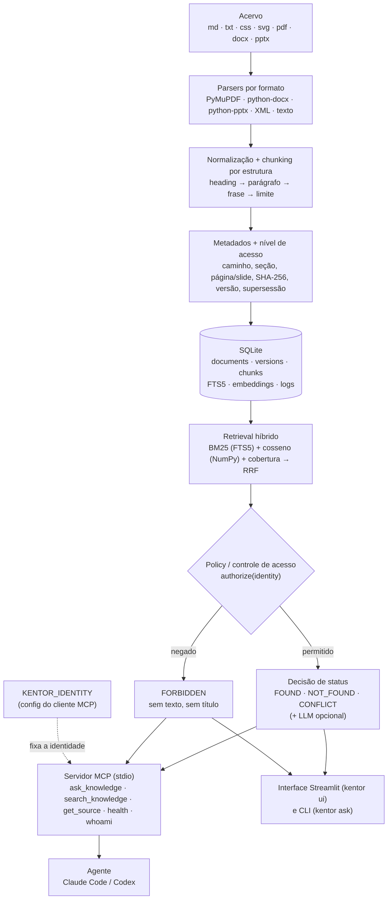

# Arquitetura

## Componentes

| Camada | Módulo | Responsabilidade |
|---|---|---|
| Parsers | `src/kentor_memoria/parsers/` | Um parser por formato; devolve blocos com `heading_path`, `page`/`slide`, metadados (frontmatter, datas de PDF/DOCX/PPTX). |
| Chunking | `ingestion/chunker.py` | Doc ≤ 1.500 caracteres fica inteiro; o resto é agrupado por seção até cerca de 1.200 caracteres, sem cortar frase; tabela grande repete o cabeçalho; marcadores `[p. N]` para citação precisa. |
| Ingestão | `ingestion/pipeline.py` | SHA-256 + versão do parser = fingerprint; pula o que não mudou; versiona o que mudou; marca removidos, duplicatas exatas e supersessões explícitas; embeddings com cache por hash do texto. |
| Supersessão | `ingestion/supersession.py` | Só sinais declarados (frontmatter `substitui:`, `status: obsoleto`, cabeçalho "Substitui o \"X\""). Nunca por data. |
| Busca | `retrieval/` | Análise PT (stopwords + Snowball), FTS5/BM25 com expressões, embeddings (fastembed multilíngue ou LSA offline), cobertura ponderada por IDF, fusão RRF. |
| Afirmações | `retrieval/claims.py` | Extrai "número + substantivo" (`+60 clientes`, `10 primeiros clientes`) para detectar conflito; ignora frases marcadas como vencidas. |
| Política | `permissions/` | Níveis ordenados (`team < commercial < restricted`), regras por caminho, identidades em YAML, identidade fixada no processo MCP. |
| Resposta | `answering/service.py` | Decide o status, monta evidências (só autorizadas), resposta extrativa ou via LLM, registra log. |
| LLM | `llm/` | OpenRouter opcional: verifica se as evidências respondem e redige a resposta; registra tokens e custo reais. |
| MCP | `mcp_server/server.py` | FastMCP (SDK oficial), stdio. |
| Interface | `ui/bridge.py`, `ui/app.py` | Streamlit, só apresentação. Chama `KnowledgeService.ask`, a mesma função do CLI e do MCP, e exibe o resultado. Identidades vêm do YAML e as perguntas de demo de `config/demo_questions.yaml`. |

## Esquema do banco (SQLite)

- `documents`: um por caminho canônico. Guarda id estável, `content_hash`, `fingerprint`, `current_version`, `status` (active/superseded/duplicate/deleted), `access_level` e metadados.
- `document_versions`: histórico de versões (hash, nº de chunks, data).
- `chunks`: texto, seção, página/slide, `access_level`, `active`. Chunks de versões antigas ficam inativos.
- `chunks_fts`: índice FTS5 (radicais), sincronizado só com chunks ativos.
- `embeddings`: `(content_hash, model) → vetor float32`. Texto igual não é reembedado.
- `relations`: supersessões explícitas (resolvidas ou não).
- `ingestion_runs`, `query_log`, `llm_usage`: observabilidade.

## Fluxo de uma pergunta

1. O agente chama `ask_knowledge("Quanto a empresa cobra por um projeto de automação?")`.
2. O servidor resolve a identidade pelo `KENTOR_IDENTITY` do processo. Se o agente pedir outra, recebe FORBIDDEN.
3. A pergunta vira radicais (`empres`, `cobr`, `projet`, `autom`). "cobra" indica que a resposta é um valor, então o trecho precisa conter `R$`.
4. O FTS5 (BM25) e os embeddings buscam candidatos em todo o acervo, e o RRF funde os rankings com o de cobertura.
5. Relevante é o trecho com cobertura ≥ 0,55. O melhor relevante é `pricing-interno.md`, de nível `commercial`.
6. Para `marketing`, a política nega: a resposta é FORBIDDEN, sem nenhum texto. Para `vendas`/`socio`: FOUND, com o trecho e a fonte.
7. Tudo é registrado em `query_log`: ids, scores e tempos. Texto de chunk nunca vai para o log.
